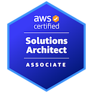

# 🌩️ Kien Nguyen (Trung) — Aspiring AWS Solutions Architect

  Passionate about Cloud Architecture, Distributed Systems, and Scalable Backend Engineering.

  
  
  
  

---

## 👋 About Me

Hello! I’m **Kien Nguyen (Trung)** — an IT student and aspiring **AWS Solutions Architect** with a strong focus on **cloud-native system design, scalability, and reliability**.

I have successfully **passed the AWS Certified Cloud Practitioner** exam and am currently **actively preparing for the AWS Solutions Architect certification**, with the goal of mastering real-world cloud architectures rather than just passing exams.

My learning philosophy is simple:  
**design → build → break → optimize → repeat**.
## 🏅 AWS Certifications

  

  

## 🎯 Current Focus

🔭 **What I’m working on**
- Designing **scalable and fault-tolerant architectures** on AWS
- Building cloud-based backend systems using:
  - EC2, ALB, Auto Scaling
  - Lambda, API Gateway, DynamoDB
  - S3, CloudFront, IAM
- Developing **real-time & low-latency systems** (networking-focused projects)

🌱 **What I’m learning**
- AWS **Well-Architected Framework**
- High Availability & Disaster Recovery (HA/DR)
- Cost optimization strategies
- CloudFront caching & load balancing patterns
- Infrastructure as Code using **Terraform**
- CI/CD pipelines using native AWS services

🚀 **Next milestone**
- AWS Certified **Solutions Architect**
- Production-grade multi-tier architectures
- Portfolio-ready cloud projects

---

## 🤝 Collaboration & Interests

👯 **Open to collaborate on**
- Cloud-native applications
- Student or early-stage startup projects
- Systems that require **scalability, performance, and clean architecture**

🤝 **Looking for guidance on**
- Multi-region AWS architectures
- Advanced HA/DR designs
- Real-world cost optimization techniques
- Production CI/CD and Terraform workflows

💬 **Ask me about**
- AWS fundamentals & cloud architecture concepts
- Backend engineering with C#/.NET
- Networking basics (TCP/UDP, sockets, concurrency)
- System design thinking for distributed systems

⚡ **Fun fact**
- I enjoy transforming simple ideas into **production-ready cloud architectures** — from zero to scalable systems.

---

## 🛠️ Tech Stack

### ☁️ Cloud & DevOps
- **AWS** (EC2, S3, IAM, VPC, CloudFront, Lambda, DynamoDB, API Gateway)
- Terraform (Infrastructure as Code)
- Docker
- Linux

### 🧠 Backend & Networking
- C#, .NET
- Node.js
- REST APIs
- TCP / UDP
- Socket Programming
- Multithreading & Concurrency

### 🔧 Tools
- Git & GitHub
- GitHub Actions
- VS Code
- Postman
- Wireshark
- Fiddler

---

## 🌐 Socials

- **Facebook**: https://www.facebook.com/kiennguly24  
- **LinkedIn**: https://www.linkedin.com/in/kien-vpc-peering/

---

## 📊 GitHub Stats

---
## ✍️ Philosophy

> “Cloud architecture is not about services — it’s about **trade-offs, resilience, and decisions under constraints**.”

---

⭐ If you find my projects or learning journey interesting, feel free to connect or follow along.  
I’m always open to learning, building, and improving.
