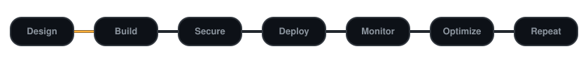

# Nguyen Trung Kien — DevOps & Cloud Engineer

  

  

---

### 👋 About Me

Hello! I’m **Trung Kien** — a Cloud & DevOps Engineer specializing in building secure, high-availability, and cost-efficient cloud architectures. My expertise lies in automating infrastructure provisioning, securing software supply chains (DevSecOps), and designing robust observability systems.

I bridge the gap between development and operations with a security-first mindset. My philosophy:

  

---

### 🛡️ DevSecOps & Cloud Security Practices
Security is not an afterthought; it is integrated into every layer of the cloud and application lifecycle:

*   **🔒 Cloud Infrastructure Security (AWS)**
    *   **Compute & Orchestration**: Deploying secure workloads on **AWS EC2**, **Amazon ECS (Fargate)**, and **Amazon EKS (Kubernetes)** with strict network segregation.
    *   **IAM Least Privilege**: Enforcing granular IAM policies, mapping Kubernetes service accounts to AWS IAM Roles (IRSA), and minimizing root/admin usage.
    *   **Network Isolation**: Architecting multi-VPC environments with secure **VPC Peering**, Private Subnets, NAT Gateways, Transit Gateways, and strict Security Groups.
*   **🚀 Automated Secure Pipelines (CI/CD)**
    *   **Orchestration**: Building declarative, repeatable pipelines using **GitHub Actions** and **Jenkins** to automate build, security, and deployment steps.
    *   **Static Code Quality & Security**: Implementing **SonarQube** quality gates to catch code smells, bugs, and security vulnerabilities early in the commit phase.
    *   **Vulnerability Scanning**: Scanning container base images and applications using **Trivy** for CVE detection before storage.
    *   **Artifact Repository**: Storing and managing secure docker images and packages in **Sonatype Nexus** with registry scanning enabled.
*   **🔑 Secrets Management & GitOps**
    *   Implementing GitOps-safe secrets management using **HashiCorp Vault**, **AWS Secrets Manager**, and **Kubernetes External Secrets Operator (ESO)** to eliminate hardcoded credentials in repositories.
*   **📊 Observability & Security Monitoring**
    *   Monitoring infrastructure metrics, resource exhaustion, and security events using **Prometheus** and visualizing them via dynamic **Grafana** dashboards.

---

### 🏅 Professional Certifications

  

---

### 🛠️ Tech Stack & Tooling

  

---

### 🌐 Connect with Me

  
  &nbsp;
  

---

  

